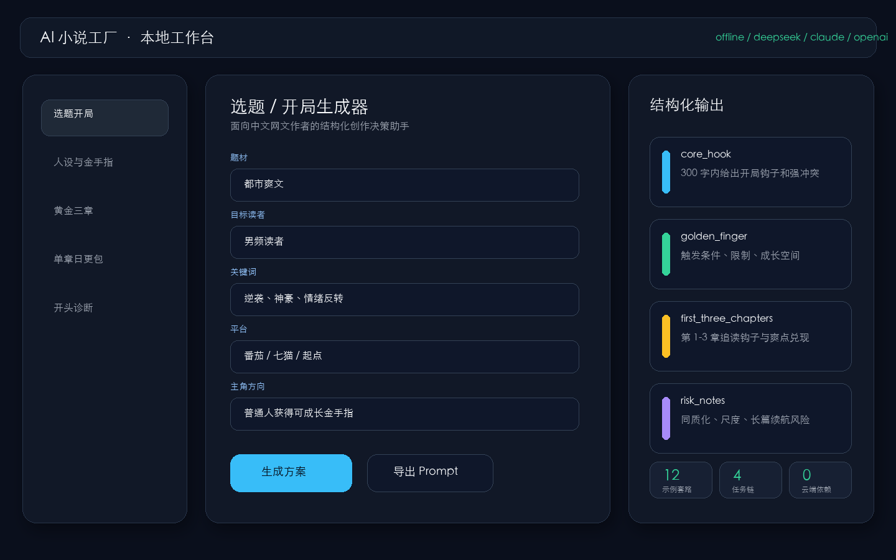
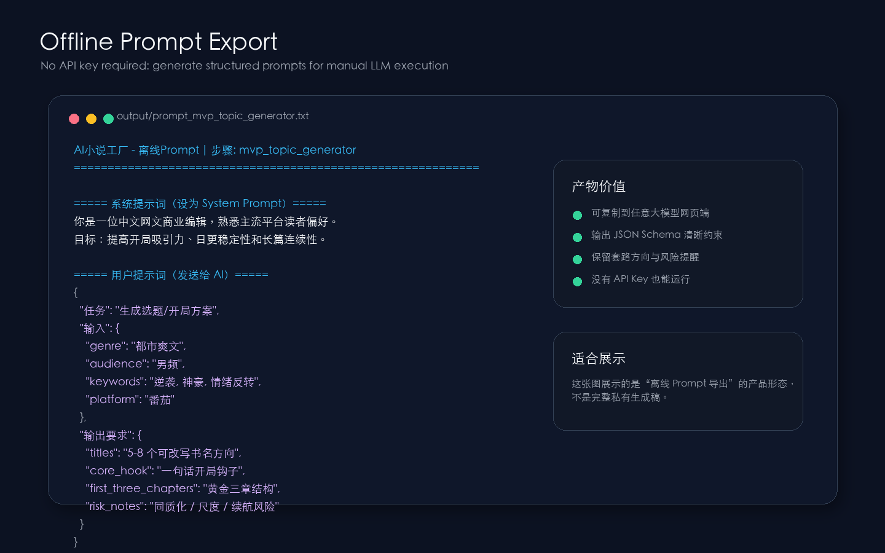
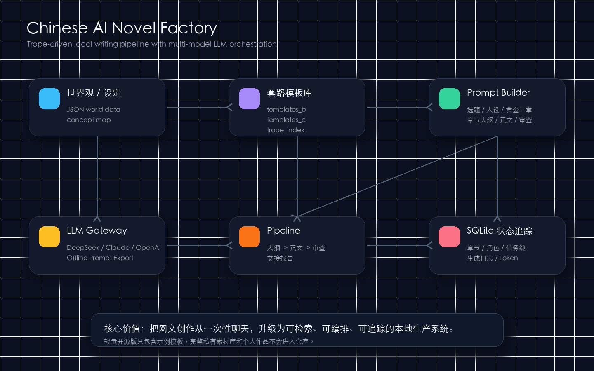

# Chinese AI Novel Factory

一个面向中文网文创作的本地 AI 小说工厂。项目把“套路模板库、Prompt 编排、多模型调用、章节生产、质量审查、项目状态管理”拆成可维护的模块，帮助作者把长篇小说创作从零散灵感推进到可复用、可追踪、可自动化的生产流程。

本仓库是轻量开源版：代码框架完整保留，`data/` 中只放少量示例模板，用于展示系统如何加载、检索和编排套路资产。完整私有模板库、个人作品和运行数据不包含在开源仓库中。

## 项目截图

### 本地创作工作台



### 离线 Prompt 产物示例



### 核心架构流程



## 核心优势

### 1. 本地优先，隐私友好

项目默认在本地运行，世界观、角色、章节、生成日志和会员额度都存储在本机文件或 SQLite 中。没有强依赖云端数据库，也不要求用户把作品资料上传到第三方平台。

当没有配置 API Key 时，系统会自动进入离线模式，把结构化 Prompt 导出到 `output/`，作者可以手动复制到任意大模型网页端使用。这个设计让项目在“无 Key、无网络、低成本”的情况下仍然可用。

### 2. 套路模板驱动，而不是一次性问答

系统不是简单地把用户输入直接丢给大模型，而是把网文创作拆成可复用的套路资产：

- `templates_b/`：单个剧情套路的逻辑骨架。
- `templates_c/`：贯穿多章节的任务链模板。
- `trope_index.json`：套路名称、分类、标签、描述和文件映射。

这种结构让创作流程更稳定：模型不是凭空发挥，而是在“题材、人物、冲突、爽点、章节目标、已有设定”的约束下生成内容。

### 3. Prompt 工程模块化

项目内置多个 Prompt Builder，把不同创作场景拆成独立工作流：

- 选题/开局生成
- 人设与金手指设计
- 黄金三章细纲
- 单章日更包
- 作品开头诊断
- 章节大纲、正文、审查报告、交接记忆

每个工作流都有明确输入、输出和生成参数，便于继续扩展成 API、Web UI 或 SaaS 产品。

### 4. 多模型 LLM 网关

`core/llm_gateway.py` 提供统一模型调用入口，当前支持：

- DeepSeek
- Anthropic Claude
- OpenAI
- Offline Prompt Export

上层业务不直接依赖某一家模型 API，而是通过统一网关调用。后续接入其他 OpenAI-compatible 模型时，只需要扩展网关层。

### 5. 章节生产流水线

`core/pipeline.py` 把单步生成能力编排成完整章节生产流程：

1. 读取世界观、概念图谱、套路索引和任务线。
2. 根据章节目标检索适合的套路。
3. 生成分镜式大纲。
4. 生成正文草稿。
5. 执行质量审查。
6. 生成交接报告，供下一章衔接。

这套流程强调“连续创作”，不是孤立生成一段文本。

### 6. SQLite 状态追踪

系统使用 SQLite 记录项目进度，包括：

- 章节状态
- 角色档案
- 任务线进度
- 生成日志
- Token 使用统计

这让项目具备持续生产和恢复上下文的能力，也为后续做数据看板、多人协作、会员系统打下基础。

### 7. 多项目管理

`core/project_manager.py` 支持为不同小说项目创建独立目录。每个项目可以拥有自己的：

- 世界观
- 套路库副本
- SQLite 数据库
- 输出目录
- 章节记忆

这使它从单本小说脚本升级为一个可扩展的创作工作台。

### 8. 轻量产品化雏形

`web_api.py` 和 `static/index.html` 提供了一个本地 Web MVP，包括“小说日更助手”相关接口和页面。它不是完整 SaaS，但已经具备产品化拆分：

- FastAPI 后端
- 本地单页前端
- 工作流 API
- 本地额度记录
- 调用日志
- 离线模式兜底

## 功能概览

- 本地 Web 工作台和 CLI 双入口。
- 套路库关键词检索，可选语义搜索。
- DeepSeek、Claude、OpenAI 多模型适配。
- 无 API Key 时自动导出 Prompt。
- 世界观、概念图谱、模板库统一加载。
- 章节大纲、正文、审查、报告流水线。
- 多项目目录隔离。
- SQLite 持久化章节、角色、任务和日志。
- MVP 会员额度与调用记录。

## 技术栈

- Python 3.8+
- FastAPI
- Uvicorn
- Pydantic
- SQLite
- OpenAI-compatible API
- Anthropic SDK
- Vanilla HTML/CSS/JavaScript frontend

可选增强：

- sentence-transformers
- scikit-learn

## 快速开始

Python 版本建议为 3.8 或更高。

```bash
python -m venv .venv
source .venv/bin/activate
pip install -r requirements.txt
```

复制环境变量示例文件并填入自己的 API Key：

```bash
cp .env.example .env
```

如果不配置 API Key，系统会进入离线模式，把可复制到大模型网页端的 Prompt 导出到 `output/`。

启动 Web 版本：

```bash
uvicorn web_api:app --reload --port 8000
```

然后打开：

```text
http://localhost:8000
```

启动命令行版本：

```bash
python main.py
```

## 常用配置

常用环境变量见 `.env.example`。

```bash
LLM_PROVIDER=deepseek
DEEPSEEK_API_KEY=
DEEPSEEK_MODEL=deepseek-chat
DEEPSEEK_BASE_URL=https://api.deepseek.com
ANTHROPIC_API_KEY=
OPENAI_API_KEY=
MVP_ENFORCE_QUOTA=false
MVP_DEFAULT_MONTHLY_QUOTA=30
```

支持的 `LLM_PROVIDER`：

- `deepseek`
- `claude`
- `openai`

## 核心目录

```text
.
├── main.py                  # CLI 入口
├── web_api.py               # FastAPI 入口
├── config.py                # 路径、模型、API 配置
├── static/index.html        # 本地 Web 前端
├── core/
│   ├── data_manager.py      # JSON/SQLite 数据访问
│   ├── llm_gateway.py       # 多模型 LLM 适配和离线导出
│   ├── trope_engine.py      # 套路检索
│   ├── prompt_builder.py    # 工厂主流程 Prompt
│   ├── mvp_prompts.py       # 日更助手 Prompt
│   ├── pipeline.py          # 章节生产流水线
│   ├── autopilot.py         # 批量生产编排
│   ├── project_manager.py   # 多项目管理
│   └── quota_manager.py     # 本地额度和调用日志
├── data/
│   ├── my_world.json        # 示例世界观
│   ├── concept_map.json     # 示例概念映射
│   ├── trope_index.json     # 示例套路索引
│   ├── templates_b/         # 示例单套路逻辑骨架
│   └── templates_c/         # 示例长线任务模板
├── tools/rebuild_index.py   # 重建套路索引
└── docs/ARCHITECTURE.md     # 架构说明
```

## 主要工作流

### 小说日更助手 MVP

面向日常网文创作的轻量工作流：

- 选题/开局生成器
- 人设与金手指
- 黄金三章细纲
- 单章日更包
- 作品开头诊断

对应实现：

- `core/mvp_workflows.py`
- `core/mvp_prompts.py`
- `core/quota_manager.py`

### 小说工厂主流程

面向长篇项目持续推进：

- 规划模式
- 执行模式
- 批量生产
- AI 审查
- 章节交接记忆
- 项目状态追踪

对应实现：

- `core/pipeline.py`
- `core/autopilot.py`
- `core/project_manager.py`

## 数据边界

本仓库采用轻量示例数据集，只用于展示框架能力。完整私有模板库、个人作品、生成稿和运行数据库不包含在开源仓库中。

默认通过 `.gitignore` 排除：

- `.env` 和所有 API Key。
- `*.db`、`*.sqlite`、SQLite 运行数据。
- `data/mvp_usage.json`、`data/mvp_generation_log.jsonl` 等本地内测记录。
- `output/`、`memory_bank/`、`projects/` 中的生成稿、个人作品和项目状态。
- `campaign_outline_*.md`、`generated_story_outline.txt` 等个人大纲产物。

发布前可以运行：

```bash
rg --hidden -n "API_KEY|sk-|secret|password|token|/Users/|身份证|电话|微信|邮箱" .
```

## 开发说明

重建套路索引：

```bash
python tools/rebuild_index.py
```

运行基础语法检查：

```bash
python -m compileall config.py main.py web_api.py core tools
```

## 后续方向

- 增加更完整的 Web UI 状态管理。
- 增加用户作品库和章节版本管理。
- 增加更细粒度的质量评分维度。
- 增加可插拔模型供应商配置。
- 增加模板市场或模板导入导出机制。
- 增加生成结果的 EPUB/TXT 导出。
- 增加 Token 成本、产出效率和工作流转化率看板。

## License

This project is licensed under the MIT License. See the `LICENSE` file for details.
